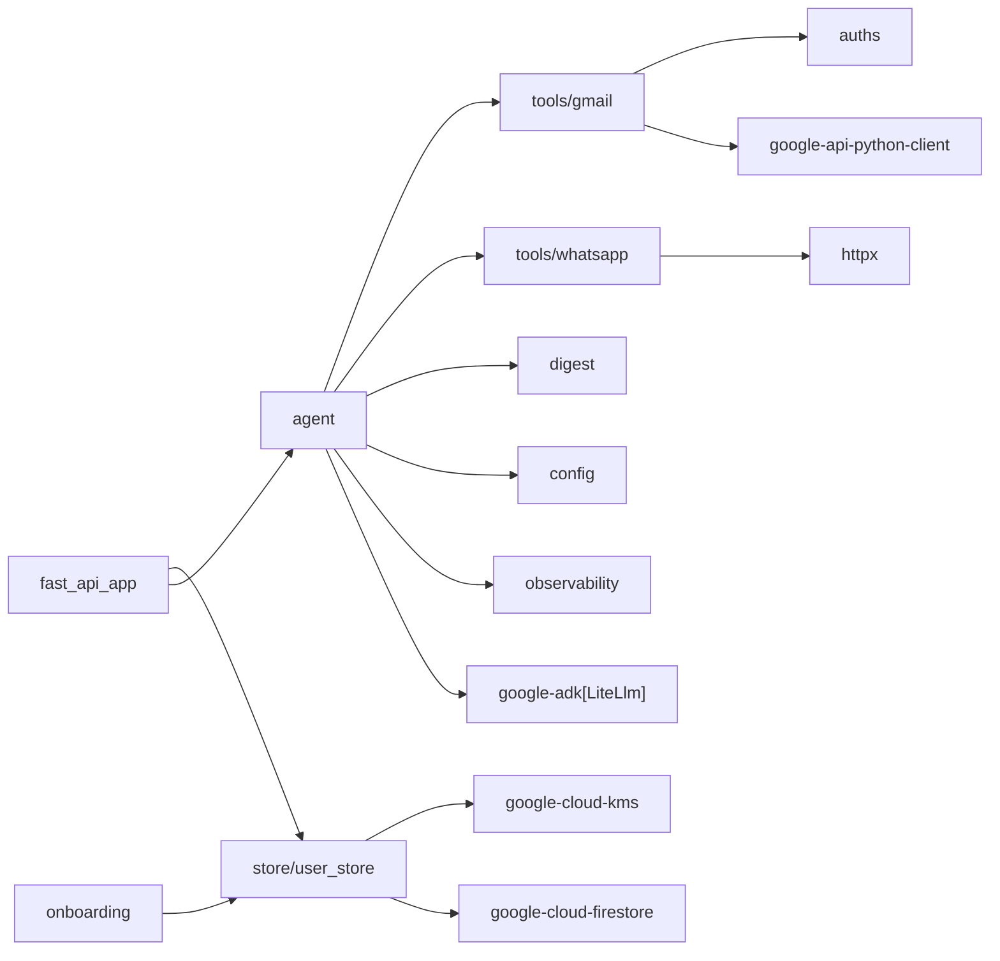

# Inbox Digest Agent — Context Graph + Structure Guide

## Context Graph (graphify)

The full dependency graph of the project — who calls what, and where data flows.

```mermaid
graph TD
  %% ─── External triggers ───────────────────────────────────────────────
  Scheduler["☁️ Cloud Scheduler\n(hourly, per user)"]
  PubSub["☁️ Pub/Sub\n(inbox-digest-triggers)"]
  Browser["🌐 User Browser"]

  %% ─── Services ────────────────────────────────────────────────────────
  subgraph onboarding_svc ["Cloud Run: inbox-digest-onboarding"]
    OnboardingApp["onboarding/main.py\n(FastAPI)"]
    Templates["templates/\nindex | setup | dashboard\nsuccess | error"]
  end

  subgraph agent_svc ["Cloud Run: inbox-digest-agent (internal)"]
    FastApiApp["app/fast_api_app.py\nADK ambient trigger\n+ state injection middleware"]
    Agent["app/agent.py\nroot_agent (ADK Agent)\n+ build_and_send_digest()"]
    GmailTool["app/tools/gmail.py\nfetch_unread_emails()\nnegotiate_creds()"]
    WhatsAppTool["app/tools/whatsapp.py\nsend_whatsapp()"]
    Digest["app/digest.py\nformat_digest() [pure Python]"]
    Auths["app/auths.py\nOAuth config + TOKEN_CACHE_KEY"]
    Config["app/config.py\nDigestConfig + model resolution"]
    Observe["app/observability.py\nstructured logging"]
  end

  subgraph storage ["Persistence"]
    UserStore["app/store/user_store.py\nUserStore\n(Firestore + KMS)"]
    Firestore["☁️ Cloud Firestore\n/users/{user_id}"]
    KMS["☁️ Cloud KMS\nuser-secrets key"]
  end

  subgraph external ["External APIs"]
    GmailAPI["📧 Gmail API v1"]
    WhatsAppMeta["💬 Meta WhatsApp\nBusiness Cloud API"]
    TwilioAPI["💬 Twilio\nWhatsApp API (optional)"]
    LLM_Gemini["🤖 Gemini\n(LiteLLM)"]
    LLM_OpenAI["🤖 OpenAI\n(LiteLLM)"]
    LLM_Anthropic["🤖 Anthropic\n(LiteLLM)"]
    GoogleOAuth["🔑 Google OAuth 2.0\n(accounts.google.com)"]
  end

  subgraph infra ["Infrastructure (Terraform)"]
    TF_Main["deployment/terraform/\ninbox-digest/main.tf\n(APIs, Firestore, KMS)"]
    TF_IAM["iam.tf\n(service accounts, roles)"]
    TF_PubSub["pubsub.tf\n(topic + push subscription)"]
    TF_Service["service.tf\n(Cloud Run + Secret Manager)"]
    TF_Monitor["monitoring.tf\n(alerts + log metrics)"]
  end

  subgraph eval_suite ["Eval (tests/)"]
    EvalDataset["tests/eval/datasets/\nbasic-dataset.json\n(6 labelled inbox scenarios)"]
    EvalConfig["tests/eval/eval_config.yaml\n(metrics config)"]
    EvalRubric["tests/eval/response_quality.py\nLLM-as-judge rubric"]
  end

  %% ─── Trigger flow ───────────────────────────────────────────────────
  Scheduler -->|"per-user message"| PubSub
  PubSub -->|"OIDC push"| FastApiApp
  FastApiApp -->|"load user config"| UserStore
  UserStore --> Firestore
  UserStore -->|"decrypt secrets"| KMS
  FastApiApp -->|"inject state + trigger"| Agent

  %% ─── Agent flow ─────────────────────────────────────────────────────
  Agent -->|"fetch_unread_emails()"| GmailTool
  GmailTool -->|"negotiate_creds()"| Auths
  GmailTool -->|"messages.list/get"| GmailAPI
  Agent -->|"LiteLLM BYOK"| Config
  Config --> LLM_Gemini
  Config --> LLM_OpenAI
  Config --> LLM_Anthropic
  Agent -->|"build_and_send_digest()"| Digest
  Agent -->|"send_whatsapp()"| WhatsAppTool
  WhatsAppTool -->|"default"| WhatsAppMeta
  WhatsAppTool -->|"WHATSAPP_PROVIDER=twilio"| TwilioAPI
  Agent --> Observe
  Observe -->|"JSON logs → stdout"| TF_Monitor

  %% ─── Onboarding flow ────────────────────────────────────────────────
  Browser --> OnboardingApp
  OnboardingApp --> Templates
  OnboardingApp -->|"OAuth consent"| GoogleOAuth
  OnboardingApp -->|"save user"| UserStore
  OnboardingApp -->|"create hourly job"| Scheduler

  %% ─── Infra wires ────────────────────────────────────────────────────
  TF_Main --> TF_IAM
  TF_Main --> TF_PubSub
  TF_Main --> TF_Service
  TF_Main --> TF_Monitor

  %% ─── Eval ───────────────────────────────────────────────────────────
  EvalDataset --> EvalConfig
  EvalRubric --> EvalConfig
```



---

## Ponytail review — simplification opportunities

Applying **ponytail/full** to the current structure. Things skipped, things to add when you need them.

### What's already minimal
- `digest.py` — pure function, no class, no config injection. ✅
- `config.py` — plain `@dataclass` with env defaults. ✅
- `observability.py` — plain `print(json.dumps(...))` captures by Cloud Run automatically; no SDK overhead. ✅
- `auths.py` — copied verbatim from the recipe; proven pattern, no changes. ✅
- Hard-filter in `gmail.py` — frozensets + a linear scan; O(n) per message, zero dependencies. ✅

### Where complexity is justified
- `UserStore` — Firestore async client + KMS encryption is essential for multi-tenant secret isolation. Not over-engineering; it IS the product.
- OAuth three-stage negotiation — security requirement, not accidental complexity.
- LiteLLM BYOK — the whole point; user-supplied keys need a routing layer.

### Ponytail simplifications applied
1. **No separate session service** — ADK handles sessions internally; `fast_api_app.py` uses the default in-memory session (fine for stateless ambient runs).
2. **No dedicated scheduler registration class** — `_register_scheduler_job()` is a module-level function, not a class.
3. **No abstract WhatsApp interface** — `send_whatsapp()` picks the provider with a single `if` branch. Two concrete functions (`_send_via_meta`, `_send_via_twilio`). One-line swap with `WHATSAPP_PROVIDER=twilio`.
4. **No ORM for Firestore** — direct Firestore `AsyncClient` calls. An ORM would be four times the code for the same result.
5. **No message queue or retry manager** — Pub/Sub dead-letter policy handles retries. Zero app-level retry code.

### Potential future simplifications (add when needed)
| Current | When to simplify | How |
|---------|-----------------|-----|
| `onboarding/main.py` manages its own OAuth flow | If using Firebase Auth or Clerk later | Replace the `/auth/login` + `/auth/callback` routes with one auth provider SDK call |
| `UserStore` has both Firestore + in-memory fallback | If you drop local-dev mode | Remove the `_local_store` dict; fail fast if Firestore is unavailable |
| `_resolve_model()` in `agent.py` reads state per-run | If you add a request-scoped DI framework | Inject via lifespan; remove `tool_context` param |
| 6 Terraform files | If single-project constraint is removed | Merge `iam.tf` into `main.tf` (4 files, same result) |

### One-line checks that should never be removed
```python
# Hard gate in build_and_send_digest — never bypass this
if len(p1_p2) < config.min_important_to_send:
    return {"status": "skipped", "reason": "no_important_emails", "sent": False}
```
```python
# Key isolation in get_agent_state — api_key only in memory, never re-persisted
return {
    ...,
    "user_config": {"llm_api_key": llm_api_key},  # decrypted, in-memory only
}
```

---

## Module dependency (simplified)



No circular imports. The store package has no dependency on app tools (correct direction: tools → store, never store → tools).
